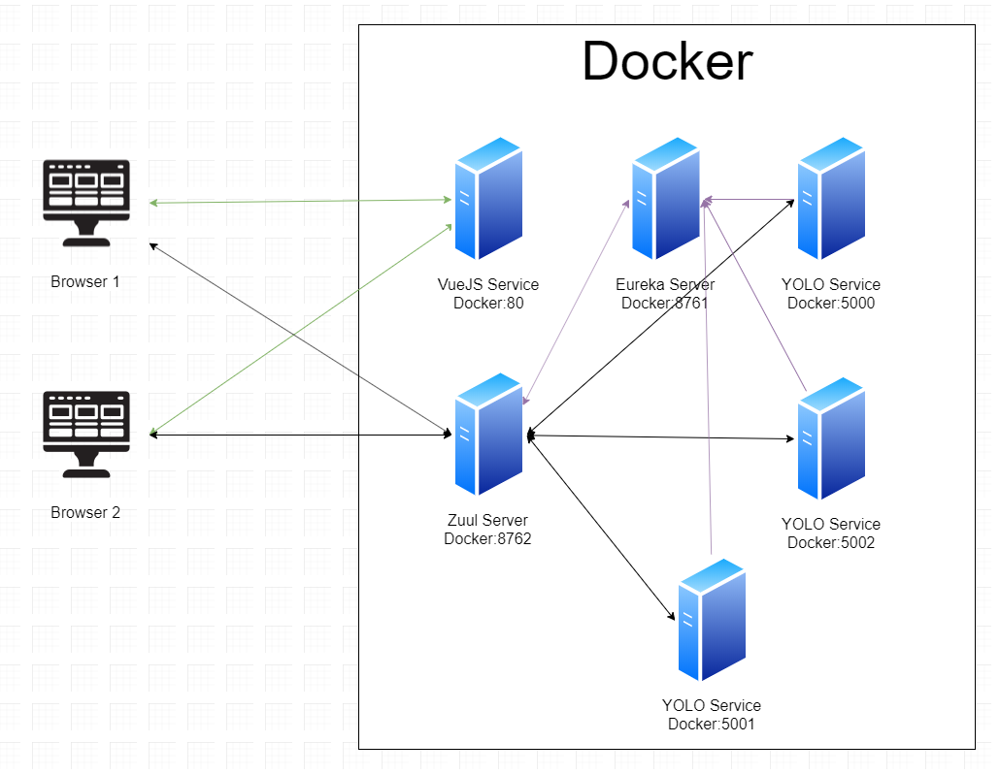

<h3 align="center">Team 02 ICT3102 Assignment 2</h3>

---

## 📝 Table of Contents

- [About](#about)
- [Usage](#usage)
- [Architecture](#architecture)

## ✍️ Prepared By

- [Hafiz Azmi](https://www.linkedin.com/in/hafiz-azmi-35661816a/)
- [Ho Hong Yue](https://www.linkedin.com/in/hongyue1995/)
- [Jovan Ho](https://www.linkedin.com/in/jovanho/)
- [Lee Qi Cheng](https://www.linkedin.com/in/lee-qicheng-10041b174/)
- [Lim Zheng Shun](https://www.linkedin.com/in/zheng-shun-lim-039420174/)
- [Nicholas Lee](https://www.linkedin.com/in/nicholas-lee-4ab684130/)

## 🧐 About <a name = "about"></a>

This project aims to create a system that provides object detection services. The system consists of a Single Page Application (SPA) frontend, and a backend that provides the object detection services. The project aims to create a system focused on scalability and has such been designed with reference to the microservice architecture. The microservice architecture breaks down a monolithic application into small invidividually callable services and each individual callable service will be run in it's own container. The idea behind it is to modularize all services so that instances of highly demanded services can be scaled up by spinning up additional containers.

## Key Features
1. Microservice Architecture - Each service is packaged into it's own container
2. Service Discovery - Dynamically add or remove services from the architecture
3. Load Balancing/ Dynamic Routing - Round Robin routing between available services
4. Caching (Partial) - Caching of responses so not all responses have to reach the end service

### Frontend

The system frontend is built in Vue.js, a javascript framework for building user interfaces and SPAs. The VueJS webserver will be packaged into its own container to allow multiple instances to be created if the demand requires.

Due to the lack of time, the team had been unabled to implement predrawing of the image while waiting for the request to return with a response.

### Backend

The system backend comprises of a Zuul server, Eureka server, and Flask server with each being packaged and deployed in it's own container.

#### [Zuul](https://github.com/Netflix/zuul)

Zuul is an edge service that provides dynamic routing and load balancing services. The system uses the base functionalities of Zuul mentioned above. Zuul and Spring have been selected as the platform as of choice due to their flexibility and ease of extensibility. Using Spring additional security layers and business logic layers can be built on top of Zuul to allow for more complex routing strategies. On boot, Zuul requests for a list of services and IPs that provided these services. Requests from the frontend are directed to the Zuul server, the Zuul server then requests for the required service from the pool of service IPs and makes the call. The response from the service is returned to the frontend.

Due to the complexity of caching input/output streams (only consumable once), the team had not been able to implete the caching of image responses. The team had however, been successfully at caching JSON responses from the YOLO server. The JSON caching functionality can be tested using POSTMAN, and accessed through the `http://localhost:8762/yolo/api/uploadTest` endpoint. The first request is expected to take the usual amount of time, while subsequent requests should be significantly faster due to caching.

Endpoints
```
View all routes to service mapping
http://localhost:8672/actuator/routes
```

#### [Eureka](https://github.com/Netflix/eureka)

Eureka is a service registry used for discovering and locating services, and essentially acts like a phone book for services. Eureka offers multiple REST endpoints for clients to register, and de-register themselves from the registry. Clients are required to send heartbeats to the Eureka server to renew their leases, faulure to do so before the lease expiry will result in them being removed from the registry. This ensures that services listed on Eureka are actually available. Multiple instances of Eureka servers can exist in the same archicture, each being in charge of discovering a specific service. Eureka servers will then be able to exchange their registries with each other, updating each others registry. This sharing of registry information between Eureka servers acts as a failover incase one registry goes down. However, as a proof of concept for this project, the team's Eureka server has been configured to run in standalone mode (1 instance).

Endpoints
```
View all registered services
http://localhost:8761

Get Information on all registered services
http://localhost:8761/eureka/apps/
```
#### Flask

The original code had been converted into a REST endpoint through the use of the python Flask framework. The model options building, and loading of options into the model have been configured to run when the service boots. Any REST requests that require the model will be able to use it without having to initialize it again, this is important as the initialization of the model options and the model take up a significant amount of time (in relation to processing the REST request).

Endpoints:
```
Accessed directly
http://localhost:5000/api/upload
http://localhost:5001/api/upload
http://localhost:5002/api/upload

http://localhost:5000/api/uploadTest
http://localhost:5001/api/uploadTest
http://localhost:5002/api/uploadTest

Accessed through Zuul
http://localhost:8762/yolo/api/upload
http://localhost:8762/yolo/api/uploadTest
```
## 🎈 Usage <a name="usage"></a>

### Prerequisites

You will require Docker and Docker Compose to be installed on your local machine to run this project.

As we will be running 3 `yolo` containers, it is recommended that you allocated at least **8GB of RAM** to your Docker Engine resources.

### Running the project

Running the command below will spin up the Docker containers that will run the application code.

```bash
docker-compose up --scale yolo=3
```

Access the frontend from `http://localhost`

## ⚙️ Architecture <a name="architecture"></a>


